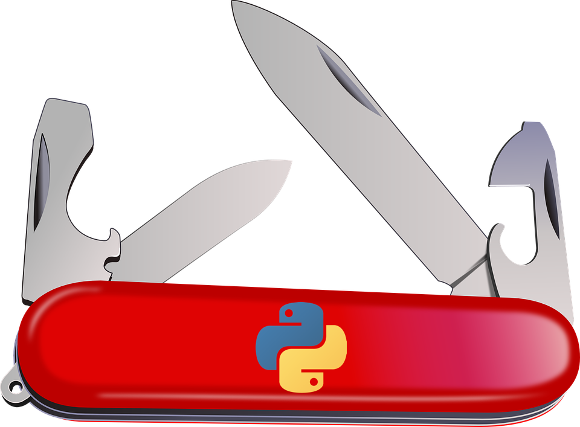

```{r setup, include=FALSE}
knitr::opts_chunk$set(collapse = TRUE)
```


# Data Analysis and Programming with Python Programming Language


```{r intro, out.width="70%", echo=FALSE}

```

This workshop website is developed and maintained by Dr. Priyanga D. Talagala

This hands-on workshop aims to equip participants with the fundamentals of programming in Python and give them skills needed to apply data analysis approaches to their research questions. The workshop will be taught in a similar style to Data Carpentry workshops. Data Carpentry’s mission is to train researchers in the core data skills for efficient, shareable, and reproducible research practices.

This work was supported in part by RETINA research lab funded by the OWSD, a program unit of United Nations Educational, Scientific and Cultural Organization (UNESCO)

## Licence 


This work is licensed under a [Creative Commons Attribution 4.0 International License](https://creativecommons.org/licenses/by/4.0/).