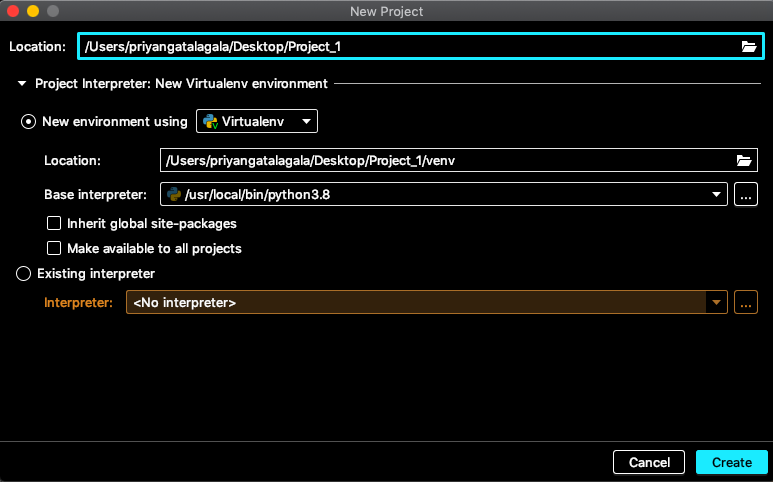

## Prerequisites

- Make sure you're using PyCharm Community or Professional.

- Make sure you've already installed Python. Python is already installed on your computer if you're running macOS or Linux. Python can be downloaded from python.org.

- Let's develop a Python script to get started with PyCharm.

---

class: inverse, middle, center

# Creating a Python project

---

1. Click New Project if you're on the Welcome screen. 

```{r   out.width = "70%", echo = FALSE, fig.cap='' }

```

---

Choose File -> New Project from the main menu if you already have a project open.

```{r   out.width = "100%", echo = FALSE, fig.cap='' }

```


---

Although PyCharm may be used to create a variety of projects, we'll use it to create a simple Pure Python project in this tutorial. This template will start with an empty project.

```{r   out.width = "70%", echo = FALSE, fig.cap='' }

```


- Choose a location for the project. Select the directory for your project by clicking the Browse button next to the Location field.

- Give a name for the project

---

-  According to Python best practices, each project should have its own virtualenv.

- PyCharm creates a fresh virtual environment for you most of the time, and you don't have to do anything. You can still see and change the venv options. Select a tool to construct a new virtual environment by expanding the **Python Interpreter: New Virtualenv Environment node**. Select the Virtualenv tool and enter the environment's location as well as the base Python interpreter for the new virtual environment.

```{r   out.width = "70%", echo = FALSE, fig.cap='' }

```
---

- The path to the Python executable must be specified when establishing the base interpreter. PyCharm offers two alternatives if it detects no Python on your machine: download the latest Python versions from [python.org](https://www.python.org/) or specify a path to the Python executable (in case of non-standard installation).

- Refer to [Configure a Python interpreter](https://www.jetbrains.com/help/pycharm/configuring-python-interpreter.html#add-existing-interpreter) for more details.

- Now click the Create button at the bottom of the New Project dialog.

- If you already have a project open, PyCharm will ask if you want to create a new project in the current window or in a new one once you click Create. Choose Open in current window to close the current project, although you can return to it later.


---
class: inverse, middle, center

# Opening a project


---

<!--
For further information, see the pages [Open, reopen, and close projects](https://www.jetbrains.com/help/pycharm/open-projects.html).

-->

- On the Welcome Screen, click the Open link.

- From the main menu, select File --> Open.

```{r   out.width = "70%", echo = FALSE, fig.cap='' }

```


---
class: inverse, middle, center

# Reopening recent projects
- PyCharm keeps a history list of recent projects from which you can choose the one you want.

- When PyCharm starts, the most recent project reopens by default (unless this option is disabled on the System Settings page of the Settings/Preferences dialog.

---
class: inverse, middle, center
 # Closing projects
 
If you need to close only one project, you can either close the project window or select File --> Close Project from the main menu.


---
class: inverse, middle, center
## Remove a project from the list of recent projects


---

- Click the closing icon for the project to remove.

- The selected project will be removed from the list of the recent project in the **Project window** and on the **Welcome screen**.


```{r   out.width = "100%", echo = FALSE, fig.cap='' }

```


---

- To remove a project only from the list on the Welcome Screen, right-click the target project and select Remove Selected from Welcome Screen.

```{r   out.width = "100%", echo = FALSE, fig.cap='' }

```


---
class: inverse, middle, center

```{r echo=FALSE}
icon::fa("github")
icon::fa("twitter")

```
pridiltal

# Acknowledgements:

This work was supported in part by RETINA research lab funded by the OWSD, a program unit of United Nations Educational, Scientific and Cultural Organization (UNESCO).

## Key References 

- [Step 1. Create and run your first Python project](https://www.jetbrains.com/help/pycharm/creating-and-running-your-first-python-project.html)

All rights reserved by Priyanga D Talagala